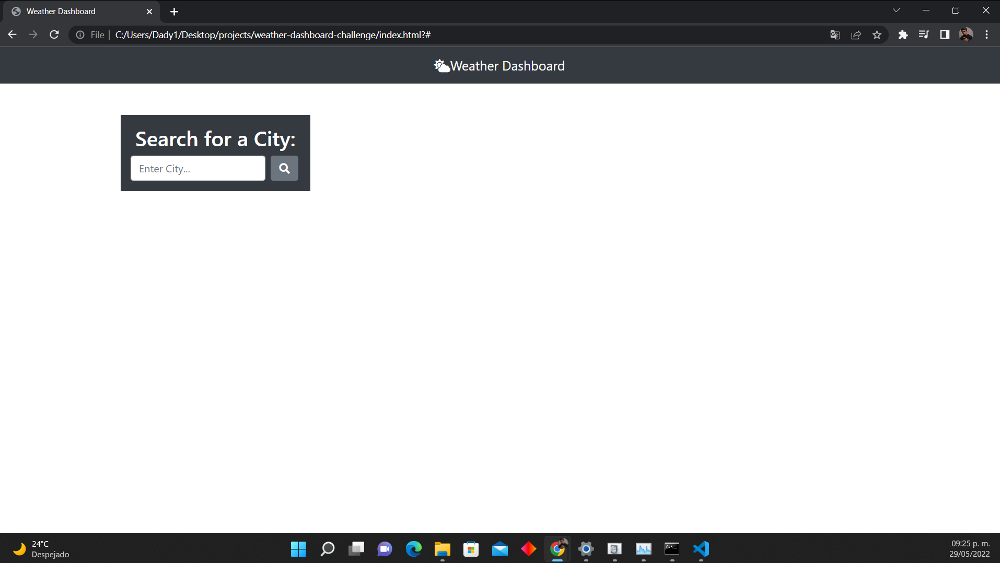
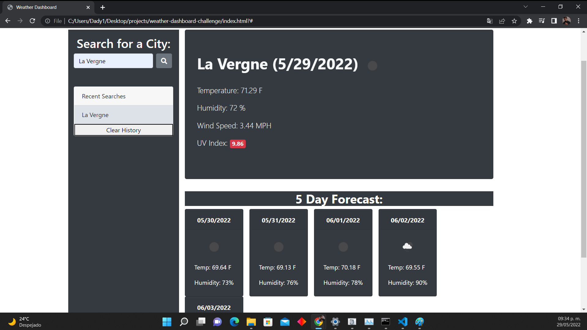

# Weather Dashboard Web

## Purpose
This website is designed for all users who want to know the weather conditions to determine what activities they will be able to do outdoors, it also helps you to perfectly plan your weather related activities because the webpage will give you a five day forecast showing you the weather of those respective days.

## Built With
* HTML
* CSS 
* JavaScript

## Website
https://israel2800.github.io/weather-dashboard-web/

## GitHub Repository
https://github.com/Israel2800/weather-dashboard-web

## Screenshots

## Contribution
Made with ❤️ by [Israel Aguilar]

### ©️2022 Weather Dashboard Challenge
